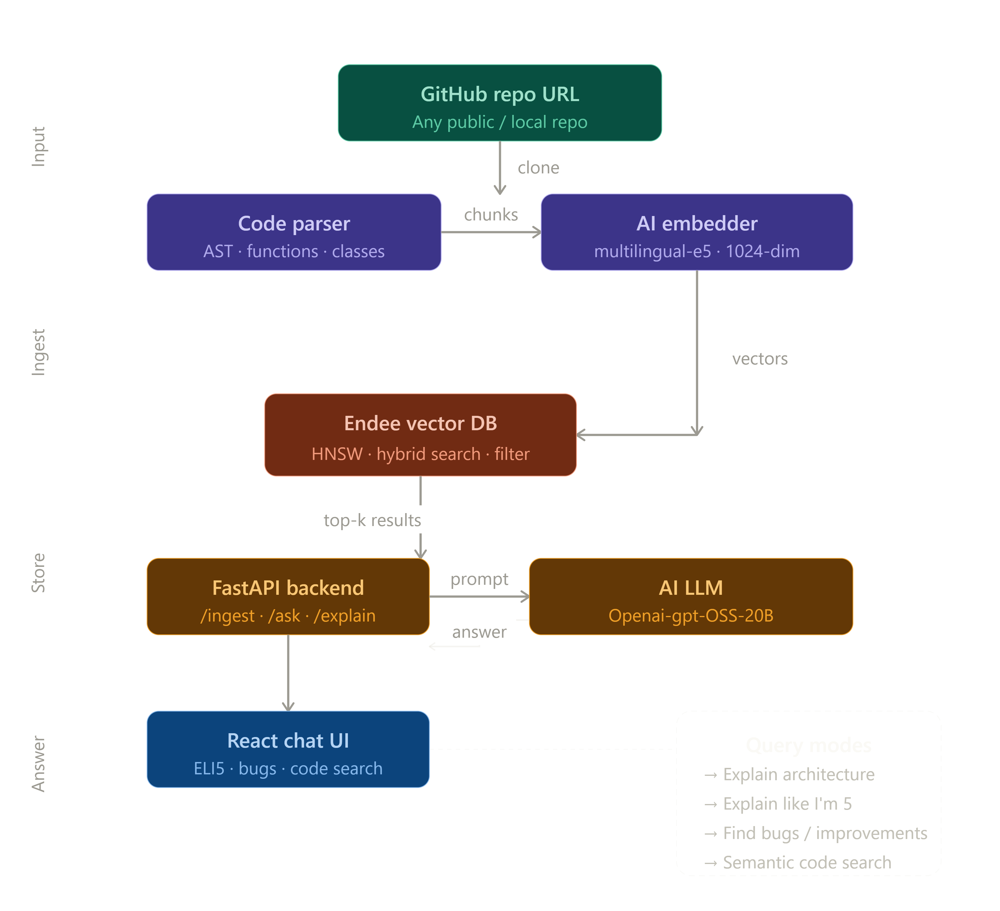

  # GitHub Codebase Explainer AI

> Ask anything about any GitHub repo — architecture, bugs, or "explain like I'm 5"
> Supports **Python, JavaScript, TypeScript, Java, Go, Rust, C, C++, Ruby, PHP, and more.**

---

## Demo


---

## System Design



---

## Supported Languages

Python · JavaScript · TypeScript · Java · Go · Rust · C · C++ · Ruby · PHP · Swift · Kotlin · Scala · Shell · and any plaintext source file

---

## Features

- **Ingest any repo** — paste a GitHub URL and the app clones, parses, embeds, and indexes it in seconds
- **Multi-language support** — works with Python, JS/TS, Java, Go, Rust, C/C++, Ruby, PHP, and more
- **Plain English Queries** — ask anything about the codebase in natural language
- **4 query modes** — Explain Architecture, ELI5, Find Bugs, and Semantic Code Search
- **Source citations** — every answer links back to the exact file and line number
- **Hybrid semantic search** — powered by Endee's HNSW vector index for fast, accurate retrieval
- **Grounded answers** — LLM only uses retrieved code as context, no hallucinated file names

---

## How It Works

1. You paste a GitHub repo URL and hit **Ingest**
2. The backend clones the repo and walks every source file
3. Functions, classes, and code blocks are chunked and embedded via any OpenAI-compatible embedding API
4. Embeddings are stored in Endee vector DB with file + line metadata
5. When you ask a question, Endee retrieves the top 5 most semantically similar chunks
6. Those chunks are passed as context to the LLM which generates a grounded answer
7. The answer is returned to the UI with source citations

---

## Tech Stack

| Layer       | Technology                                                                        |
|-------------|-----------------------------------------------------------------------------------|
| Backend     | Python · FastAPI                                                                  |
| Vector DB   | Endee (Docker · port 8080)                                                        |
| Embeddings  | Any OpenAI-compatible embeddings API (`intfloat/multilingual-e5-large-instruct`)  |
| LLM         | Any OpenAI-compatible chat completions API (`openai/gpt-oss-20b`)                 |
| Frontend    | HTML · CSS · JavaScript                                                           |

---

## Project Structure

```
codebase-explainer/
├── backend/
│   ├── main.py        # FastAPI app — /ingest, /ask, /status
│   ├── ingest.py      # Clone repo → parse all languages → embed → upsert to Endee
│   ├── agent.py       # Query Endee → build context → call LLM → return answer + sources
│   └── config.py      # Load .env vars
├── frontend/
│   └── index.html   # Dark-themed chat UI with mode selector
├── .env.example
├── requirements.txt
└── README.md
|___endee/
```

---

## Setup & Run

### Prerequisites

- [Python 3.10+](https://www.python.org/downloads/)
- [Docker](https://www.docker.com/get-started)
- [Git](https://git-scm.com/downloads)

### 1 — Clone this repo

```bash
git clone https://github.com/<your-username>/codebase-explainer-ai.git
cd codebase-explainer-ai
```

### 2 — Start Endee vector DB

```bash
docker run -d \
  -p 8080:8080 \
  -v endee-data:/data \
  --name endee-server \
  endeeio/endee-server:latest
```

Verify it's running at `http://localhost:8080`.

### 3 — Configure environment

```bash
cp .env.example .env
```

Edit `.env` with your API credentials:

```env
OPENAI_API_KEY=your_api_key_here
OPENAI_BASE_URL=https://api.together.xyz/v1
LLM_MODEL=openai/gpt-oss-20b
```

> The app uses the standard OpenAI Python SDK with a custom `base_url`, so it works with **any OpenAI-compatible provider** — Together AI, OpenRouter, Groq, local Ollama, etc.

Full variable reference:

| Variable        | Default                                       | Description                            |
|-----------------|-----------------------------------------------|----------------------------------------|
| OPENAI_API_KEY  | (required)                                    | API key for your chosen provider       |
| OPENAI_BASE_URL | `https://api.together.xyz/v1`                 | Base URL of your OpenAI-compatible API |
| EMBED_MODEL     | `intfloat/multilingual-e5-large-instruct`     | Embedding model name                   |
| EMBED_DIM       | `1024`                                        | Embedding dimension                    |
| LLM_MODEL       | `openai/gpt-oss-20b`                          | Chat completion model name             |
| ENDEE_URL       | `http://localhost:8080/api/v1`                | Endee API base URL                     |
| INDEX_NAME      | `codebase_index`                              | Endee index name                       |
| BATCH_SIZE      | `50`                                          | Max vectors per upsert batch           |
| MAX_CHUNK_CHARS | `2000`                                        | Max chars per chunk for embedding      |
| MAX_META_CHARS  | `500`                                         | Max chars stored in vector metadata    |
| TOP_K           | `5`                                           | Search results to retrieve             |

### 4 — Install dependencies

```bash
pip install -r requirements.txt
```

### 5 — Start the backend

```bash
cd backend
uvicorn main:app --host 0.0.0.0 --port 8000 --reload
```

### 6 — Open the app

Go to `http://localhost:8000`, paste any GitHub URL, and start asking.

---

## API Reference

### `POST /ingest`

```json
{ "repo_url": "https://github.com/user/repo" }
```

```json
{
  "files_processed": 34,
  "chunks_indexed": 212,
  "message": "Successfully ingested 212 chunks from 34 files."
}
```

### `POST /ask`

```json
{ "question": "How does authentication work?", "mode": "explain" }
```

```json
{
  "answer": "Authentication is handled via JWT tokens...",
  "sources": [
    { "name": "login", "file": "auth.py", "line": 42, "similarity": 0.91 }
  ],
  "mode": "explain"
}
```

### `GET /status`

```json
{
  "status": "ready",
  "total_vectors": 212,
  "index_name": "codebase_index",
  "dimension": 1024
}
```

---

## Query Modes

| Mode    | What it does                                             |
|---------|----------------------------------------------------------|
| explain | Senior engineer walkthrough — architecture, data flow    |
| eli5    | Simple analogies, zero jargon — anyone can understand    |
| bugs    | Code reviewer — spots edge cases, missing error handling |
| search  | Semantic code search — finds relevant functions fast     |

---

## Quick Test

```bash
# Ingest a repo
curl -X POST http://localhost:8000/ingest \
  -H "Content-Type: application/json" \
  -d '{"repo_url": "https://github.com/psf/requests"}'

# Ask a question
curl -X POST http://localhost:8000/ask \
  -H "Content-Type: application/json" \
  -d '{"question": "How does session handling work?", "mode": "explain"}'

# Check index
curl http://localhost:8000/status
```

---

## Why Endee

Most vector search demos just swap in whichever DB is trending. We chose Endee specifically because:

- **HNSW indexing** gives sub-millisecond search even across large codebases
- **Hybrid search (BM25 + dense vectors)** means we can match both exact function names *and* semantic meaning — pure vector search misses the former
- **Metadata filtering** lets us scope searches by file type or language without re-embedding
- **Single-node scalability up to 1B vectors** — this demo uses hundreds of chunks, but the same setup handles enterprise monorepos without infrastructure changes

---

## License
See [endee/LICENSE](endee/LICENSE) for the Endee vector database license.
